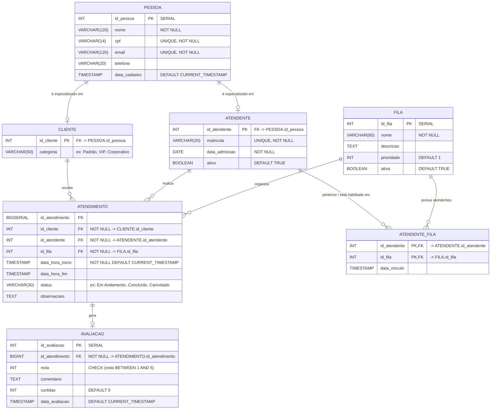

# Sistema de Atendimento
Atividade 2 de Introdução a Banco de Dados: ciclo de vida completo do desenvolvimento de um banco de dados relacional, utilizando o SGBD PostgreSQL.

## Tema
 Implementação de um sistema para uma empresa que precisa gerenciar o registro e o fluxo de atendimentos, controlando filas, atendentes e clientes.

## Objetivo Geral
Modelar, estruturar e implementar uma base de dados relacional robusta e normalizada para gerenciar o fluxo operacional de atendimentos em uma organização. O sistema é responsável pelo controle de filas segmentadas por serviço, alocação de atendentes qualificados e registro rastreável de cada atendimento realizado, garantindo a integridade dos dados e o histórico das interações com os clientes.

## Público-alvo
* **Gestores e Supervisores de Atendimento:** Necessitam monitorar o volume de atendimentos por fila, tempos médios, métricas de produtividade dos atendentes e distribuição da demanda.

* **Atendentes/Operadores:** Profissionais que atuam diretamente prestando suporte ou serviços nas filas designadas.

* **Clientes:** Usuários finais que solicitam e recebem atendimento nos diversos canais/filas da empresa.

## Regras de Negócio
1. **Unificação de Pessoas:** 
   * Um atendente também pode figurar como cliente da empresa. Para evitar duplicidade de dados cadastrais (como CPF, e-mail, telefone e nome) e garantir consistência na integridade referencial, adotou-se a entidade generalizada `pessoa`, especializada em `cliente` e `atendente`.
2. **Filas de Atendimento:**
   * A empresa organiza suas demandas por filas temáticas.
3. **Alocação de Atendentes às Filas (N:N):**
   * Um atendente pode ser habilitado a atender em múltiplas filas, e uma fila pode contar com vários atendentes aptos (`atendente_fila`).
4. **Registro de Atendimentos:**
   * Cada atendimento registra obrigatoriamente: data/hora de início e fim, status, a fila correspondente, o atendente responsável e o cliente atendido.

## Diagrama do Modelo Relacional (ERD)

O diagrama abaixo representa a estrutura lógica e física das tabelas, chaves primárias (`PK`), chaves estrangeiras (`FK`) e seus respectivos tipos de dados no PostgreSQL, renderizado nativamente pelo GitHub com **Mermaid**:

## Cardinalidades
### 1. `PESSOA` ⟷ `CLIENTE` (1:1 condicional / Especialização)
* **Uma Pessoa para Cliente:** Uma pessoa pode ser cliente ou não ($0, 1$).
* **Um Cliente para Pessoa:** Todo registro de cliente referencia obrigatoriamente uma única pessoa ($1, 1$).
* **Regra de Negócio:** Permite o reaproveitamento de dados cadastrais (CPF, e-mail, nome) sem redundância.

### 2. `PESSOA` ⟷ `ATENDENTE` (1:1 condicional / Especialização)
* **Uma Pessoa para Atendente:** Uma pessoa pode ser atendente ou não ($0, 1$).
* **Um Atendente para Pessoa:** Todo atendente é obrigatoriamente uma pessoa física cadastrada ($1, 1$).
* **Regra de Negócio:** Viabiliza que o mesmo indivíduo seja registrado como colaborador e também receba atendimentos como cliente.

### 3. `ATENDENTE` ⟷ `FILA` (N:M via `ATENDENTE_FILA`)
* **Atendente para Filas:** Um atendente pode estar vinculado a nenhuma fila (recém-admitido) ou a múltiplas filas ($0, N$).
* **Fila para Atendentes:** Uma fila pode ter zero atendentes alocados no momento ou vários atendentes aptos ($0, N$).
* **Implementação:** Relacionamento muitos-para-muitos decomposto pela tabela associativa `atendente_fila`, cuja chave primária composta garante que um atendente não seja duplicado na mesma fila.

### 4. `CLIENTE` ⟷ `ATENDIMENTO` (1:N)
* **Cliente para Atendimentos:** Um cliente pode nunca ter aberto um atendimento ou possuir múltiplos registros históricos ($0, N$).
* **Atendimento para Cliente:** Cada sessão de atendimento deve estar associada a exatamente um cliente ($1, 1$).

### 5. `ATENDENTE` ⟷ `ATENDIMENTO` (1:N)
* **Atendente para Atendimentos:** Um atendente pode ainda não ter realizado atendimentos ou ter realizado dezenas deles ($0, N$).
* **Atendimento para Atendente:** Cada atendimento é conduzido por exatamente um operador responsável ($1, 1$).

### 6. `FILA` ⟷ `ATENDIMENTO` (1:N)
* **Fila para Atendimentos:** Uma fila pode não ter nenhum atendimento registrado ou agregar múltiplos atendimentos ($0, N$).
* **Atendimento para Fila:** Todo atendimento obrigatoriamente pertence a uma fila específica de triagem/serviço ($1, 1$).

## Regras de Integridade Aplicadas
### 1. Integridade de Entidade (`PRIMARY KEY`)
* Toda tabela possui uma chave primária explicitamente definida, impedindo a existência de tuplas (linhas) idênticas ou não identificáveis:
  * **Chaves Substitutas (`SERIAL`/`BIGSERIAL`):** Adotadas em `pessoa`, `fila` e `atendimento` para garantir indexação leve e rápida.
  * **Chave Primária Composta:** Utilizada em `atendente_fila (id_atendente, id_fila)` para impedir vínculos repetidos entre o mesmo operador e a mesma fila.

### 2. Integridade de Domínio e Chaves Candidatas (`UNIQUE`, `NOT NULL`, `CHECK`)
* **Restrição de Nulidade (`NOT NULL`):** Campos críticos de identificação e controle transacional (como `nome`, `cpf`, `email`, `matricula`, `data_hora_inicio`) têm preenchimento obrigatório.
* **Chaves Únicas (`UNIQUE`):**
  * `pessoa.cpf`: Garante que um mesmo CPF não seja inserido duas vezes.
  * `pessoa.email`: Impede duplicação de e-mails de contato.
  * `atendente.matricula`: Assegura a unicidade do código funcional de cada funcionário.
  * `fila.nome`: Evita a criação de filas duplicadas com o mesmo rótulo.
* **Validações Lógicas (`CHECK`):**
  * Consistência Temporal: A data/hora de encerramento não pode ser anterior à data/hora de abertura (`CHECK (data_hora_fim IS NULL OR data_hora_fim >= data_hora_inicio)`).
  * Status Válidos: O status do atendimento deve respeitar uma lista controlada (`CHECK (status IN ('Em Andamento', 'Concluído', 'Cancelado'))`).
  * Prioridade Positiva: A prioridade da fila deve ser sempre maior ou igual a 1 (`CHECK (prioridade >= 1)`).

### 3. Integridade Referencial (`FOREIGN KEY`)
Garante que nenhum registro órfão ou inconsistente exista no banco de dados:
* **Especializações (`CASCADE`):**
  * Se um registro na tabela base `pessoa` for excluído, os dados complementares em `cliente` e `atendente` são removidos automaticamente (`ON DELETE CASCADE`), mantendo a sincronia da herança relacional.
* **Histórico Transacional (`RESTRICT`):**
  * Não é permitido excluir um `cliente`, `atendente` ou `fila` caso existam atendimentos vinculados a eles no histórico (`ON DELETE RESTRICT`). Isso preserva a rastreabilidade e a auditoria operacional da empresa.

## Tecnologias
* PostgreSQL